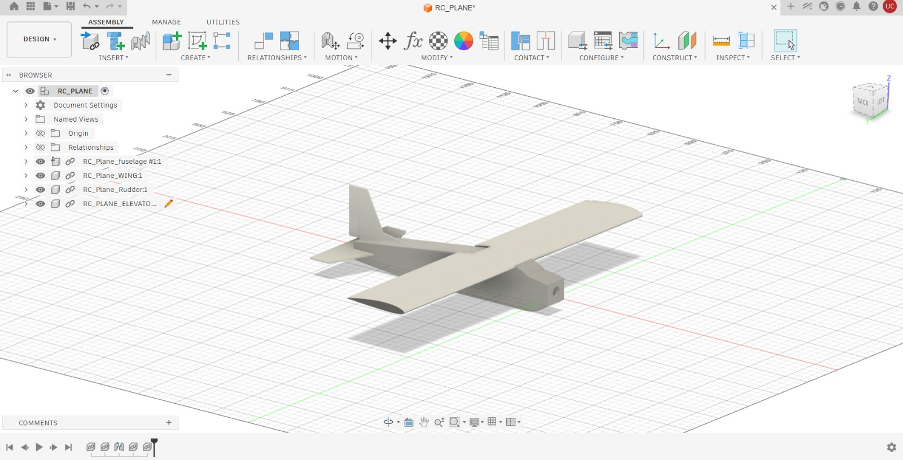
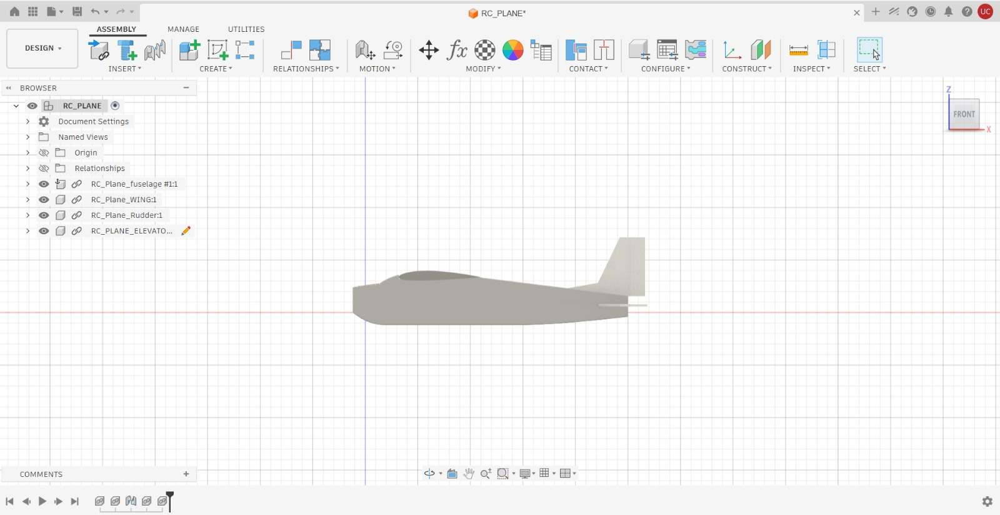
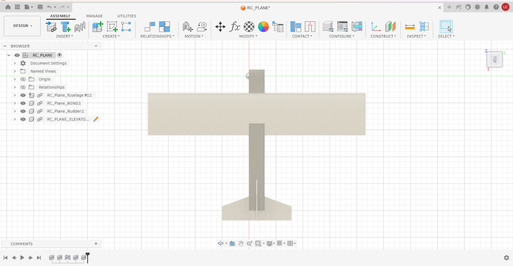
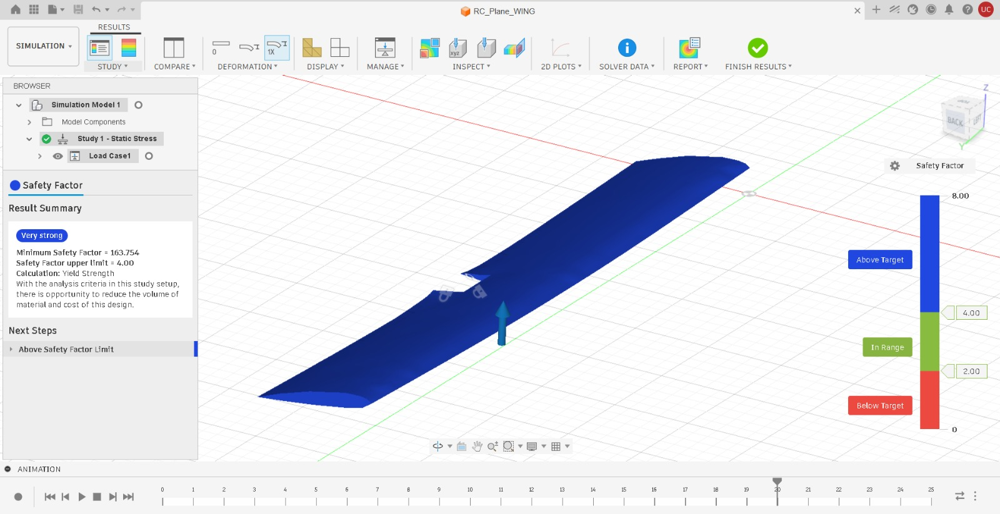
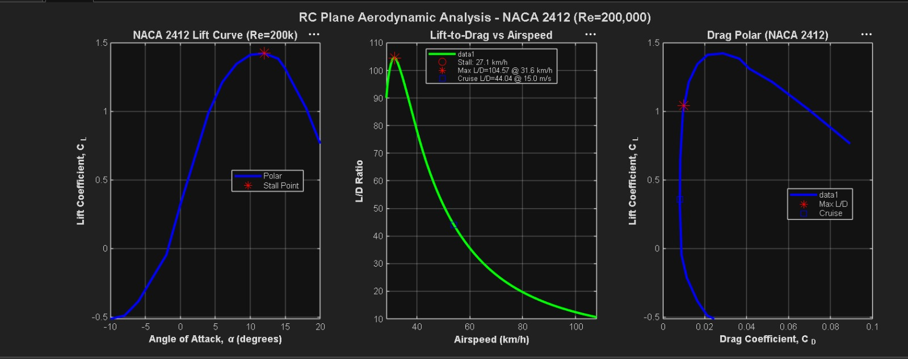

# RC Plane CAD & Aerodynamic Analysis

A full engineering analysis of an existing RC aircraft — reverse-engineered from physical measurements, modeled in CAD, structurally validated, and analyzed aerodynamically using real airfoil data.

## Overview

This project takes a build I already own — a 990g fixed-wing RC trainer — and treats it as a case study in aircraft design analysis. The goal wasn't to build something new, but to demonstrate the full analysis workflow an aerospace engineer applies to an existing airframe: measuring and reconstructing the geometry in CAD, validating the wing structure under maneuvering loads, and characterizing the aircraft's aerodynamic performance using real airfoil data rather than textbook approximations.

The work is split into three parts:

1. **CAD modeling** (Fusion 360) — full geometry reconstruction from physical measurements
2. **Structural analysis** (Fusion Simulation) — wing stress under a 3G maneuvering load
3. **Aerodynamic analysis** (MATLAB) — stall speed, lift-to-drag performance, and cruise efficiency using NACA 2412 wind tunnel polars

## Aircraft Specifications

| Parameter | Value |
|---|---|
| Wingspan | 1010 mm |
| Wing chord (uniform) | 195 mm |
| Airfoil | NACA 2412 |
| Wing area | 0.197 m² |
| Aspect ratio | 5.18 |
| Fuselage length | 625 mm |
| Horizontal stabilizer span | 325 mm (tapered, 120 mm root / 60 mm tip) |
| Vertical fin height | 146 mm (swept) |
| Weight | 990 g |
| CG location | 245 mm from nose |
| Wing loading | 50.2 N/m² |
| Motor | 1000KV, 10×6 prop |
| Battery | 11.1V 2200mAh 3S LiPo |

All dimensions were taken directly from the physical aircraft and cross-checked against photos before modeling.

## CAD Design

The aircraft was modeled as four separate bodies in Fusion 360, then assembled into a single file:

- **Fuselage** — tapered profile (72 mm nose → 35 mm tail), motor mount cutout, battery bay opening, shelled/hollowed for weight, 2.5 mm edge fillets
- **Wing** — NACA 2412 airfoil sketched from manually-entered coordinates (UIUC/airfoiltools.com `.dat` file), lofted root-to-tip across the full 1010 mm span, with a center notch cut through the trailing edge to seat the fuselage
- **Horizontal tail** — stabilizer and elevator as separate hinged bodies, tapered planform, hinge pin and control horn modeled
- **Vertical tail** — fixed fin and rudder as separate hinged bodies, swept planform

**Wing spar:** A rectangular spar (~10 mm × 1010 mm, 5 mm extrusion) was added roughly 50 mm aft of the leading edge, modeled in stainless steel, to reinforce the wing against bending loads — see Structural Analysis below.





## Structural Analysis

**Objective:** Verify the wing survives a 3G maneuvering load without structural failure.

**Setup:**
- Wing body material: Polystyrene (closest available approximation to the depron foam used in the actual build)
- Constraint: fixed at the wing root
- Load: 30 N applied upward on the top wing surface, representing a 3G maneuver (990 g × 3g)
- Reinforcement: stainless steel spar positioned ~50 mm aft of the leading edge

**Result:**

| Metric | Value |
|---|---|
| Minimum safety factor | **163.75** |
| Safety factor target | 4.00 |
| Calculation basis | Yield strength |



The wing is well above the safety margin required — the entire structure reads "above target" on the safety factor scale, with no localized stress concentration near the root or the trailing-edge notch. In practical terms, this means the depron/spar combination has significant reserve strength beyond a 3G load, which tracks with how lightly loaded small foam RC wings typically are relative to their material strength. The main limiting factor for this design is more likely to be foam crushing/dent resistance at the point loads (hand launches, hard landings) than in-flight bending — something a foam-specific material model would capture better than the polystyrene approximation used here.

## Aerodynamic Performance

**Objective:** Characterize stall speed, lift-to-drag performance, and cruise efficiency using real airfoil data rather than empirical estimates.

**Method:** NACA 2412 lift and drag polars were pulled from Airfoil Tools (UIUC database, Xfoil-predicted) at Re = 200,000 — matching the Reynolds number at the aircraft's estimated cruise speed and chord length. These polars (CL and CD vs. angle of attack) were used directly in a MATLAB script (`performance_analysis.m`) to compute stall speed and lift-to-drag performance across the flight envelope, rather than relying on assumed CL_max or parabolic drag polar approximations.

**Results:**

| Metric | Value |
|---|---|
| Max CL | 1.42 at α = 12° |
| Stall speed (1G, level flight) | 7.52 m/s (27.1 km/h) |
| Stall speed (3G maneuver) | 13.02 m/s (46.9 km/h) |
| Max L/D | 104.57 at 8.78 m/s (31.6 km/h) |
| Cruise L/D (at 15 m/s) | 44.04 at α = 0.21° |



The three plots show the NACA 2412 lift curve, L/D vs. airspeed, and the drag polar for the wing. The aircraft cruises at a very low angle of attack (0.21°) with an L/D of 44 — well below the maximum achievable L/D of ~105, which occurs closer to the stall boundary. This is expected and appropriate: cruising near max L/D would leave little margin before stall, so trading some efficiency for a comfortable stability margin is the right call for a hand-launched trainer.

## Results & Conclusions

Putting the structural and aerodynamic analysis together:

- The wing has far more structural margin than it needs for normal 3G maneuvering — safety factor of 163.75 against a target of 4, roughly 40x over. The spar addition, while not strictly necessary at this load level based on the simulation, is cheap insurance against the point loads and mishandling that foam RC wings actually see in practice.
- The aircraft's low stall speed (7.5 m/s) and high achievable L/D (up to 104) reflect a well-matched wing loading for a lightweight trainer — consistent with easy hand launches and forgiving low-speed handling.
- Cruise performance sits well clear of stall with a large efficiency margin still in reserve, which is a sensible, conservative trim point for this class of aircraft.

The main limitation of this analysis is the use of polystyrene as a stand-in for depron foam in the structural study, and 2D airfoil polars (no 3D induced-drag/finite-wing corrections) in the aerodynamic study. Both are reasonable first-pass approximations for this scope, and the next iteration of this analysis would incorporate a proper foam material model and a finite-wing correction (e.g., lifting-line or an Oswald efficiency factor) to sharpen both results.

## Repository Structure

```
RC_Plane_Analysis-/
├── CAD_Models/          # Fusion 360 files + assembly/stress screenshots
├── MATLAB_Analysis/     # performance_analysis.m, rc_plane_specs.m, plots
├── Documentation/       # This README and supporting docs
└── README.md
```

## Tools Used

- **CAD & Simulation:** Autodesk Fusion 360 (modeling + Static Stress FEA)
- **Aerodynamic Analysis:** MATLAB
- **Airfoil Data:** NACA 2412 polars, UIUC Airfoil Coordinates Database via Airfoil Tools (Xfoil prediction, Re = 200,000)
